# EEG Spectrogram Model – XAI & Multimodal Report (chb05)

## Metrics
| Metric | Value |
|---|---|
| Accuracy | 99.42% |
| Sensitivity | 100.00% |
| Specificity | 99.13% |
| F1 | 0.9915 |
| Weighted F1 | 0.9942 |
| Best threshold | 0.28 |

Confusion matrix:

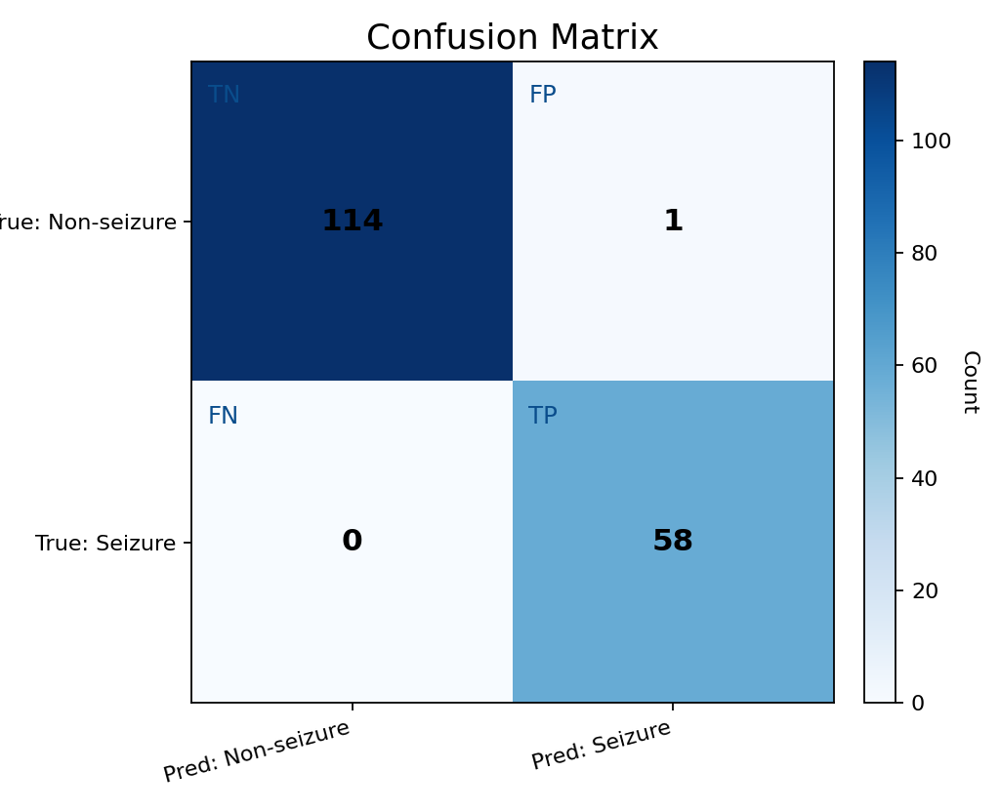

_Quadrant labels: TN = true non-seizure correctly predicted; FP = non-seizure predicted as seizure; FN = seizure predicted as non-seizure; TP = seizure correctly predicted._

## Color keys

## Examples (Spectrogram Triptych / Grad-CAM / Grad-CAM++ / IG Triptych)

**Sample 6**

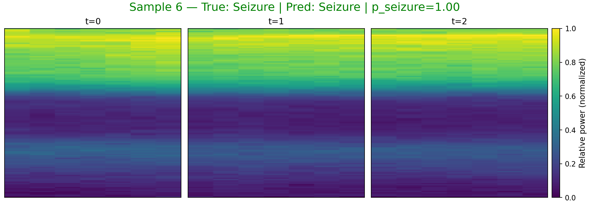

_Spectrogram color: viridis (dark→bright = low→high power)._ 

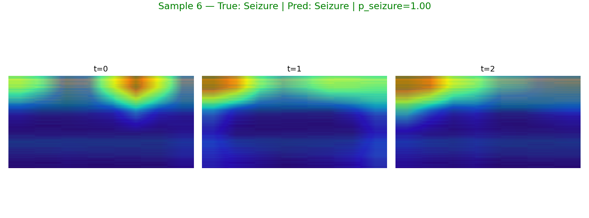

_Grad-CAM color: blue→low importance, red→high importance (overlay on spectrogram)._ 

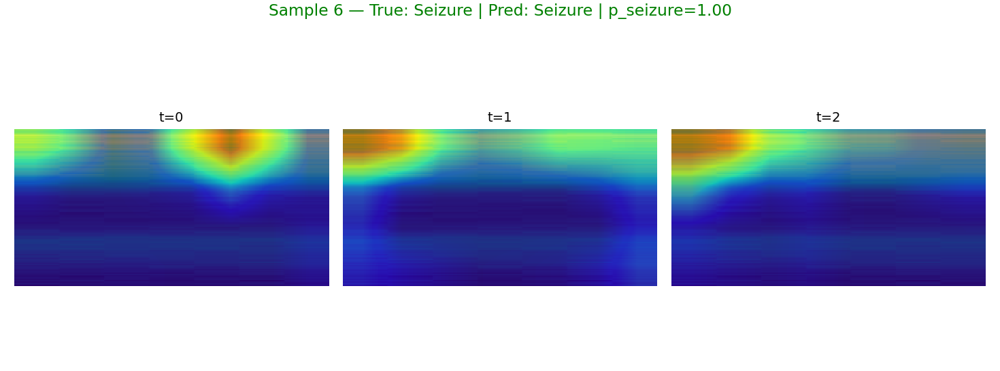

_Grad-CAM++ color: same meaning with improved weighting._ 

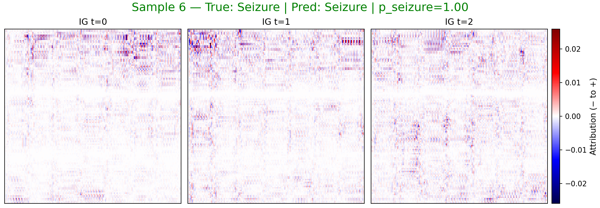

_IG color: blue = negative attribution (toward non-seizure), red = positive (toward seizure)._ 

**Sample 8**

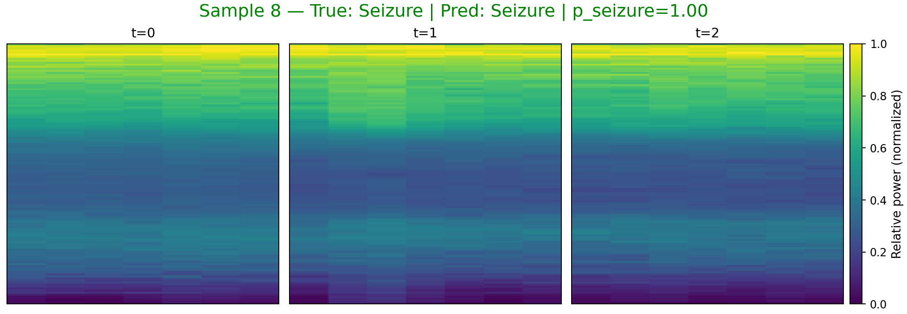

_Spectrogram color: viridis (dark→bright = low→high power)._ 

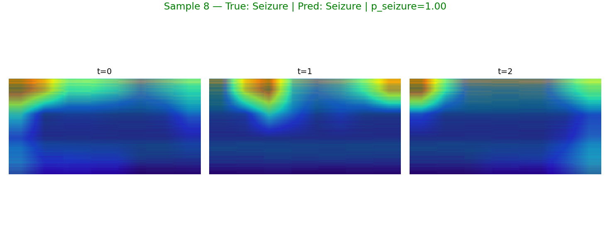

_Grad-CAM color: blue→low importance, red→high importance (overlay on spectrogram)._ 

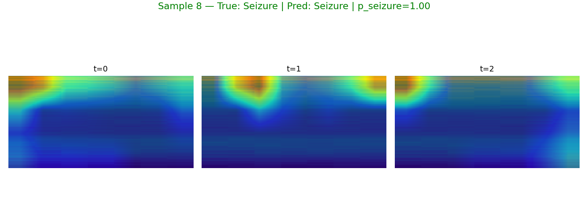

_Grad-CAM++ color: same meaning with improved weighting._ 

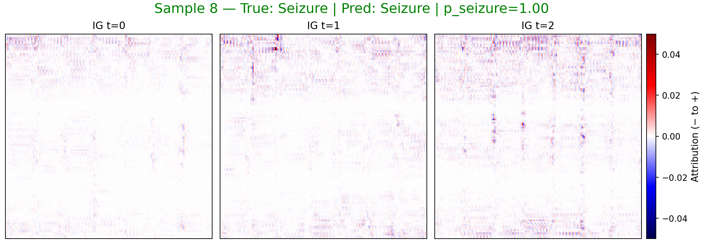

_IG color: blue = negative attribution (toward non-seizure), red = positive (toward seizure)._ 

**Sample 0**

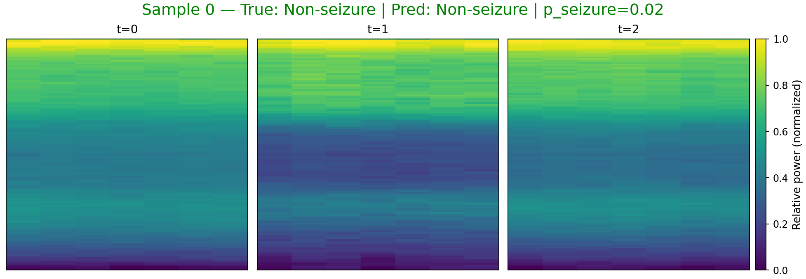

_Spectrogram color: viridis (dark→bright = low→high power)._ 

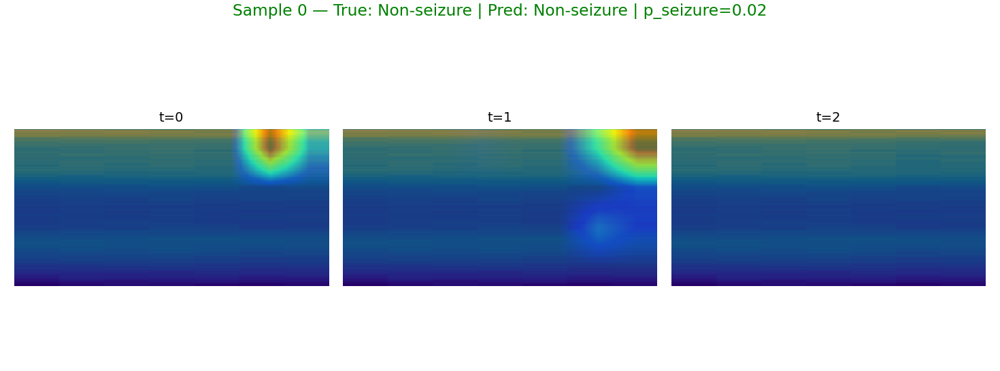

_Grad-CAM color: blue→low importance, red→high importance (overlay on spectrogram)._ 

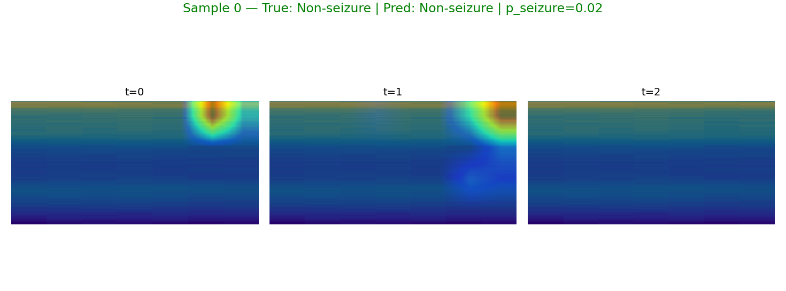

_Grad-CAM++ color: same meaning with improved weighting._ 

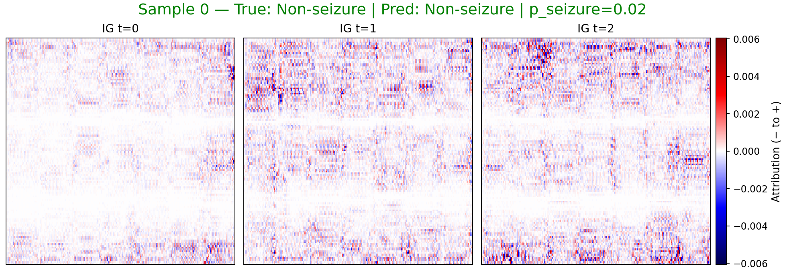

_IG color: blue = negative attribution (toward non-seizure), red = positive (toward seizure)._ 

**Sample 1**

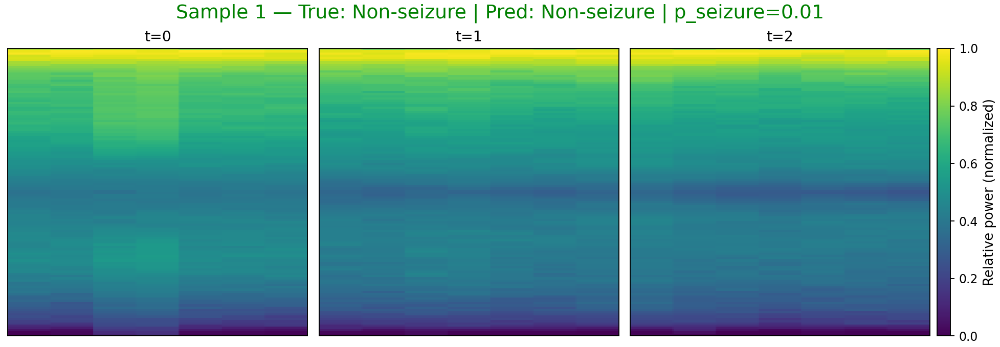

_Spectrogram color: viridis (dark→bright = low→high power)._ 

_Grad-CAM color: blue→low importance, red→high importance (overlay on spectrogram)._ 

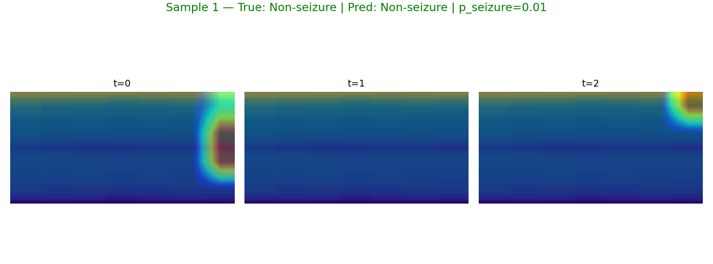

_Grad-CAM++ color: same meaning with improved weighting._ 

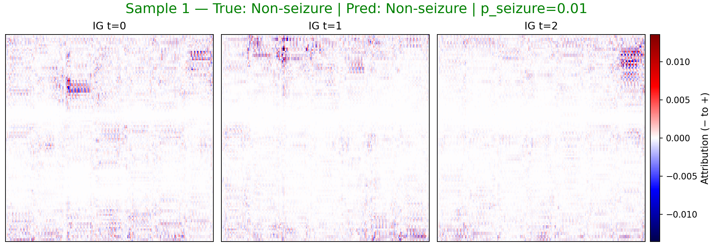

_IG color: blue = negative attribution (toward non-seizure), red = positive (toward seizure)._ 

## LLM Summary
## EEG Spectrogram Classification Report

This report details the performance of a model designed to classify EEG spectrograms as either containing seizure activity or not.

**Understanding Seizures and EEG**

A seizure is a sudden, uncontrolled electrical disturbance in the brain.  Electroencephalography (EEG) is a non-invasive test that records the brain's electrical activity using electrodes placed on the scalp.  The raw EEG data is often transformed into a spectrogram, which is a visual representation of the signal's frequency content over time.  This allows clinicians to identify patterns associated with seizures, which often manifest as specific frequency changes and rhythmic activity.

**Model Performance**

The model demonstrates high accuracy in classifying EEG spectrograms. Key performance indicators are:

*   **Accuracy:** 0.9942
*   **Sensitivity:** 1.0000 (All seizure samples were correctly identified)
*   **Specificity:** 0.9913 (Almost all non-seizure samples were correctly identified)
*   **F1:** 0.9915
*   **Weighted F1:** 0.9942
*   **Best threshold:** 0.28

These metrics indicate a robust and reliable classification performance.

**Observed Samples and Explainability**

To understand *how* the model is making its decisions, we examined specific samples and used explainability techniques like Grad-CAM and Integrated Gradients (IG). These techniques highlight the regions of the spectrogram that are most influential in the model's classification.

Here's a breakdown of four observed samples:

*   **Sample 6 (True: Seizure, Predicted: Seizure, p_seizure=0.999):** The model correctly identified this as a seizure. The explainability analysis (Grad-CAM/IG) consistently highlights the lowest frequency band (B1) across all three time segments (t=0, t=1, t=2).
*   **Sample 8 (True: Seizure, Predicted: Seizure, p_seizure=0.995):**  Similar to Sample 6, this seizure sample is correctly classified, and the lowest frequency band (B1) is consistently emphasized by the explainability methods across all time segments.
*   **Sample 0 (True: Non-Seizure, Predicted: Non-Seizure, p_seizure=0.017):** The model correctly classified this as a non-seizure.  Again, the lowest frequency band (B1) is highlighted across all time segments, but with a low probability of seizure.
*   **Sample 1 (True: Non-Seizure, Predicted: Non-Seizure, p_seizure=0.012):**  This non-seizure sample is also correctly classified.  The explainability analysis highlights the lowest frequency band (B1) across all time segments, similar to the other samples.

**Analysis of Emphasized Time-Frequency Regions**

The consistent emphasis on the lowest frequency band (B1) across both seizure and non-seizure samples is notable. In EEG analysis, specific frequency bands are associated with different brain states. While the report does not specify the exact frequency range of B1, the lowest frequency bands (delta and theta) are often associated with:

*   **Delta (0.5-4 Hz):** Deep sleep, but also can be present in certain brain disorders.
*   **Theta (4-8 Hz):** Drowsiness, meditation, but also can be associated with some seizure types, particularly in specific brain regions.

**Why this supports the decisions:**

*   **Seizures:** Many seizure types involve rhythmic, slow-wave activity in the delta or theta range. The model's emphasis on the lowest frequency band in seizure samples suggests it is detecting these abnormal, rhythmic patterns. The high `p_seizure` values for samples 6 and 8 further support this.
*   **Non-Seizures:** While delta and theta activity are not *always* indicative of seizures, their presence in the EEG is normal during certain states (e.g., sleep). The model, in these cases, is likely recognizing that the low-frequency activity is not accompanied by other features characteristic of seizures (e.g., sharp spikes, rapid evolution of frequency content). The low `p_seizure` values for samples 0 and 1 are consistent with this interpretation.

**Conclusion**

The model demonstrates excellent performance in classifying EEG spectrograms for seizure detection. The explainability analysis reveals that the model is focusing on the lowest frequency bands, which are clinically relevant for identifying seizure-related activity. Further investigation into the specific frequency range of B1 and its relationship to different seizure types would be beneficial.

## Notes
- sample 6: true=1, pred=1, p_seizure=0.999, files=[sample6_spec_triptych.png, sample6_gradcam.png, sample6_gradcampp.png, sample6_ig_triptych.png, sample6_ig_t0.png, sample6_ig_t1.png, sample6_ig_t2.png]
- sample 8: true=1, pred=1, p_seizure=0.995, files=[sample8_spec_triptych.png, sample8_gradcam.png, sample8_gradcampp.png, sample8_ig_triptych.png, sample8_ig_t0.png, sample8_ig_t1.png, sample8_ig_t2.png]
- sample 0: true=0, pred=0, p_seizure=0.017, files=[sample0_spec_triptych.png, sample0_gradcam.png, sample0_gradcampp.png, sample0_ig_triptych.png, sample0_ig_t0.png, sample0_ig_t1.png, sample0_ig_t2.png]
- sample 1: true=0, pred=0, p_seizure=0.012, files=[sample1_spec_triptych.png, sample1_gradcam.png, sample1_gradcampp.png, sample1_ig_triptych.png, sample1_ig_t0.png, sample1_ig_t1.png, sample1_ig_t2.png]
