# EEG Spectrogram Model – XAI & Multimodal Report (chb08)

## Metrics
| Metric | Value |
|---|---|
| Accuracy | 96.80% |
| Sensitivity | 94.68% |
| Specificity | 97.86% |
| F1 | 0.9519 |
| Weighted F1 | 0.9679 |
| Best threshold | 0.37 |

Confusion matrix:

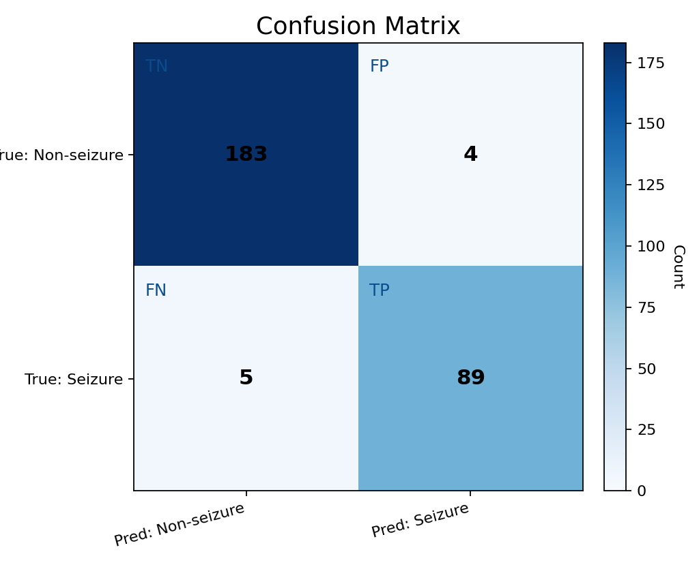

_Quadrant labels: TN = true non-seizure correctly predicted; FP = non-seizure predicted as seizure; FN = seizure predicted as non-seizure; TP = seizure correctly predicted._

## Color keys

## Examples (Spectrogram Triptych / Grad-CAM / Grad-CAM++ / IG Triptych)

**Sample 0**

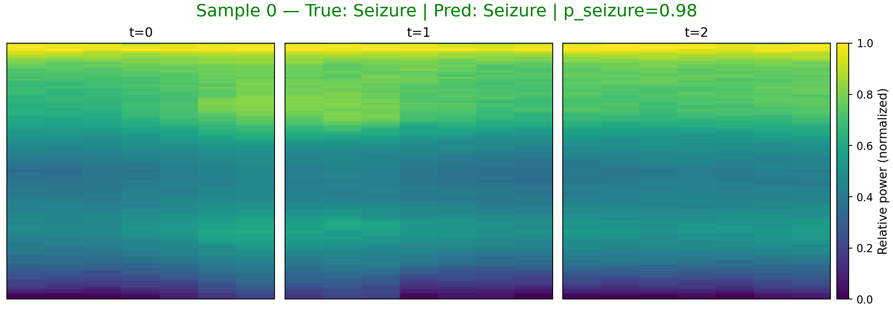

_Spectrogram color: viridis (dark→bright = low→high power)._ 

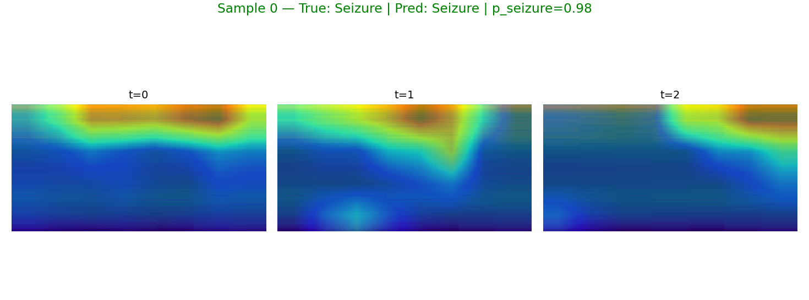

_Grad-CAM color: blue→low importance, red→high importance (overlay on spectrogram)._ 

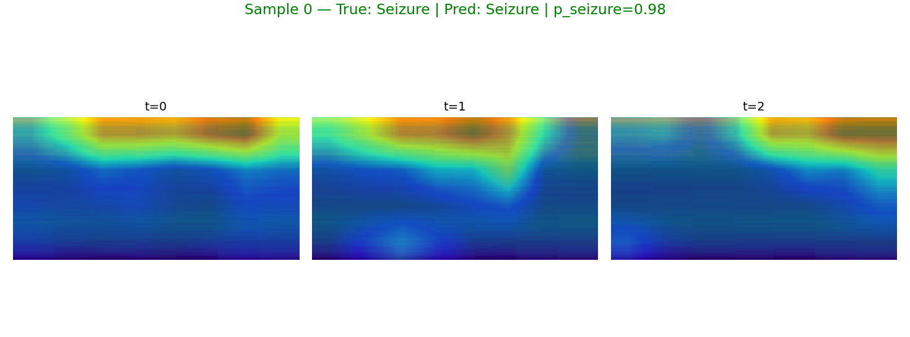

_Grad-CAM++ color: same meaning with improved weighting._ 

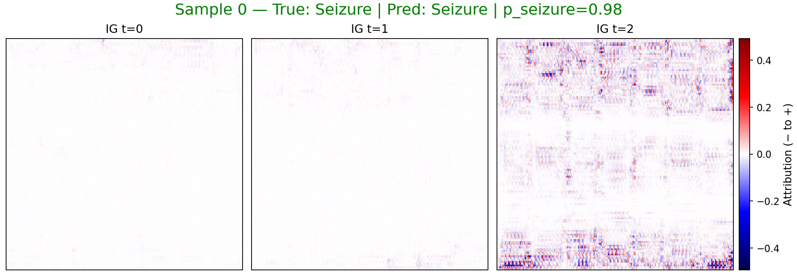

_IG color: blue = negative attribution (toward non-seizure), red = positive (toward seizure)._ 

**Sample 13**

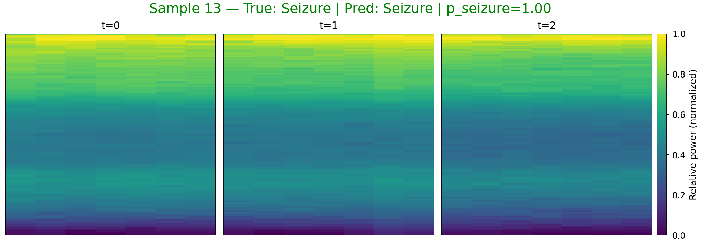

_Spectrogram color: viridis (dark→bright = low→high power)._ 

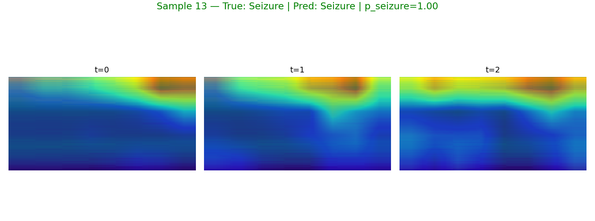

_Grad-CAM color: blue→low importance, red→high importance (overlay on spectrogram)._ 

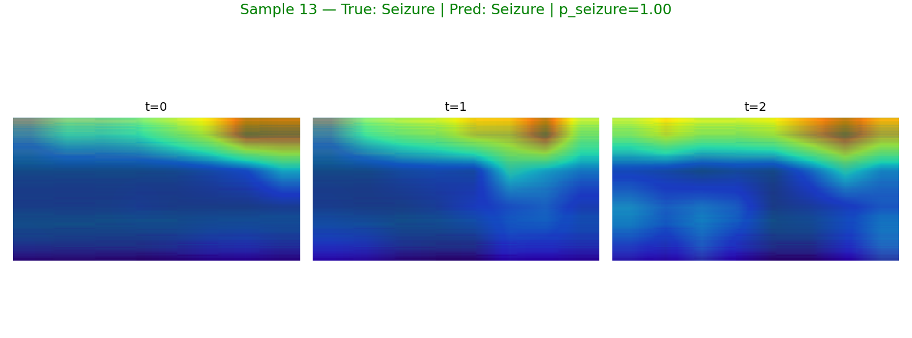

_Grad-CAM++ color: same meaning with improved weighting._ 

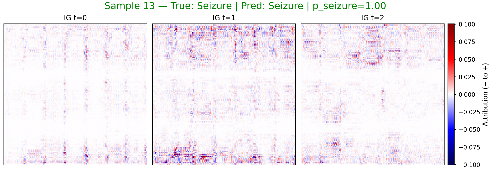

_IG color: blue = negative attribution (toward non-seizure), red = positive (toward seizure)._ 

**Sample 1**

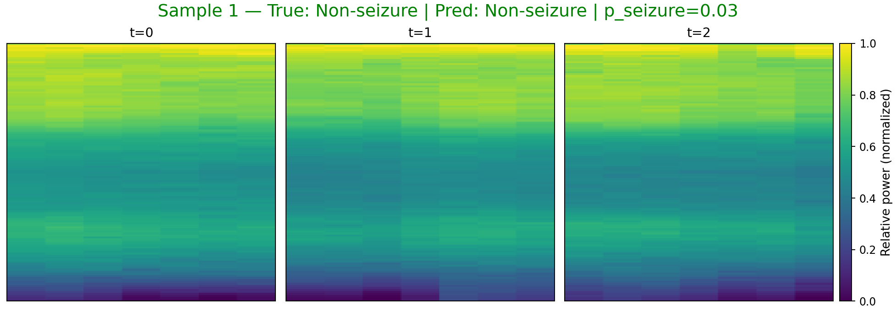

_Spectrogram color: viridis (dark→bright = low→high power)._ 

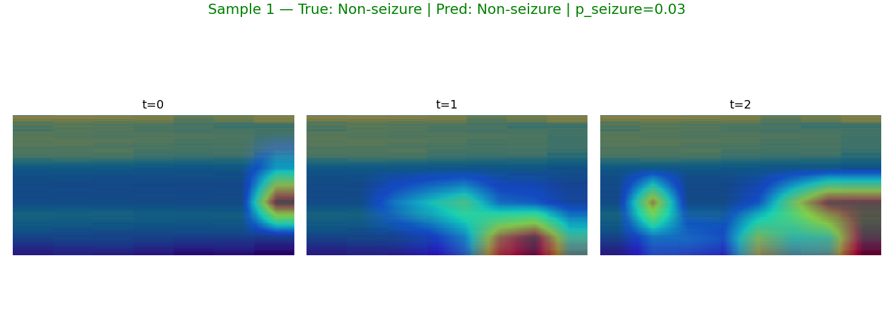

_Grad-CAM color: blue→low importance, red→high importance (overlay on spectrogram)._ 

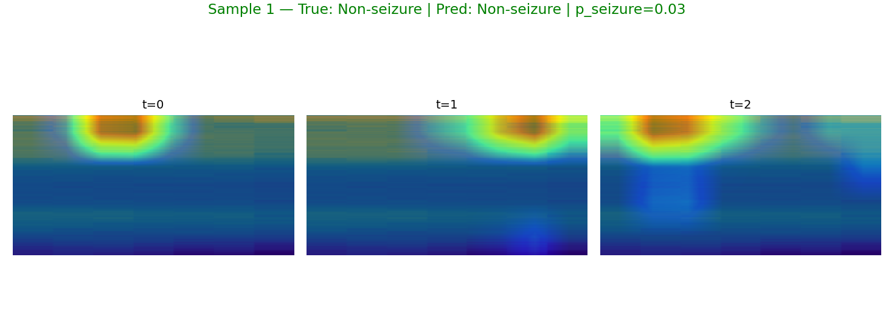

_Grad-CAM++ color: same meaning with improved weighting._ 

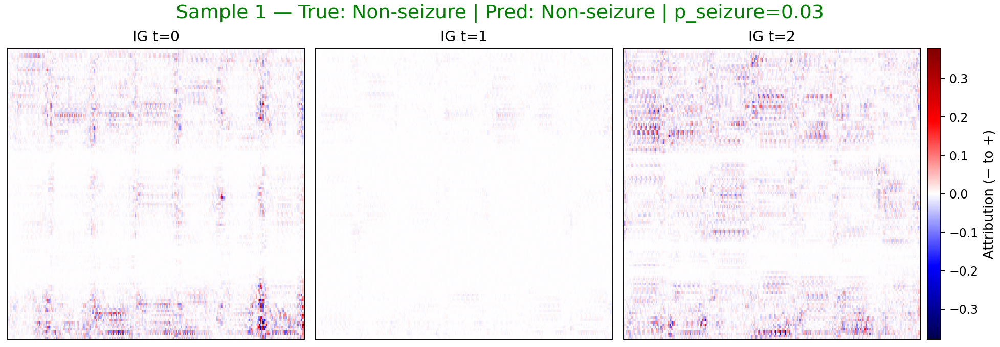

_IG color: blue = negative attribution (toward non-seizure), red = positive (toward seizure)._ 

**Sample 2**

_Spectrogram color: viridis (dark→bright = low→high power)._ 

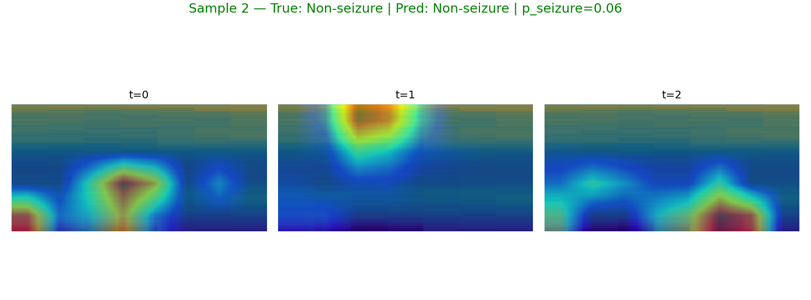

_Grad-CAM color: blue→low importance, red→high importance (overlay on spectrogram)._ 

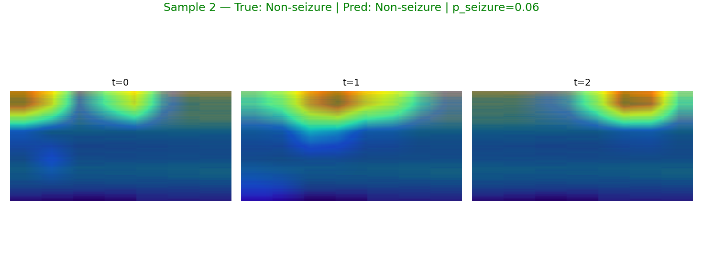

_Grad-CAM++ color: same meaning with improved weighting._ 

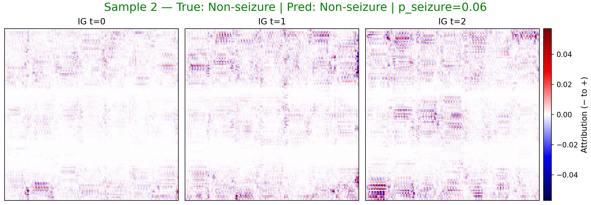

_IG color: blue = negative attribution (toward non-seizure), red = positive (toward seizure)._ 

## LLM Summary
## EEG Spectrogram Classification Report

This report summarizes the performance of a model designed to classify EEG spectrograms as either containing seizure activity or not. Before diving into the results, let's briefly define what a seizure is in the context of brain activity.

**What is a Seizure?**

A seizure is a sudden, uncontrolled electrical disturbance in the brain.  Normal brain function relies on coordinated electrical activity between neurons. During a seizure, this normal pattern is disrupted by a surge of abnormal electrical activity. This can manifest in various ways, from brief staring spells to convulsions and loss of consciousness.  EEGs are used to record this electrical activity, and seizures often have characteristic patterns that can be identified.

**Model Performance**

The model was trained to recognize these seizure patterns in EEG spectrograms. A spectrogram is a visual representation of the EEG signal, showing the different frequencies present in the signal over time.

The model achieved the following performance metrics:

*   **Accuracy:** 0.9680 (This indicates the overall correctness of the model's classifications.)
*   **Sensitivity:** 0.9468 (This indicates the model's ability to correctly identify seizure activity when it is present.)
*   **Specificity:** 0.9786 (This indicates the model's ability to correctly identify the absence of seizure activity when it is not present.)
*   **F1:** 0.9519 (This is a balanced measure of precision and recall, providing a single score for the model's performance on positive cases.)
*   **Weighted F1:** 0.9679 (This is a balanced measure of precision and recall, providing a single score for the model's performance on both positive and negative cases.)
*   **Best threshold:** 0.37 (This is the probability threshold used to classify a sample as seizure or non-seizure.)

These metrics suggest the model performs well in distinguishing between EEG spectrograms with and without seizure activity.

**Observed Samples and Explainability**

To understand *how* the model is making its decisions, we examined a few individual samples, including both correct classifications of seizure and non-seizure activity.  We used techniques like Grad-CAM and Integrated Gradients (IG) to highlight the regions of the spectrogram that were most influential in the model's decision-making process.  These techniques essentially show us which time-frequency features the model "paid attention to" when classifying the spectrogram.

Here's a breakdown of the observed samples:

*   **Sample 0 (True: Seizure, Predicted: Seizure, p_seizure=0.976):** The model correctly identified this spectrogram as containing seizure activity. The explainability analysis (Grad-CAM/IG) indicates that at time steps 0 and 1, the model focused on the lowest frequency band (B1). At time step 2, the model focused on the highest frequency band (B5).
*   **Sample 13 (True: Seizure, Predicted: Seizure, p_seizure=0.998):** The model correctly identified this spectrogram as containing seizure activity. The explainability analysis (Grad-CAM/IG) indicates that at time step 0, the model focused on the highest frequency band (B5). At time steps 1 and 2, the model focused on the lowest frequency band (B1).
*   **Sample 1 (True: Non-Seizure, Predicted: Non-Seizure, p_seizure=0.027):** The model correctly identified this spectrogram as not containing seizure activity. The explainability analysis (Grad-CAM/IG) indicates that at all time steps, the model focused on the highest frequency band (B5).
*   **Sample 2 (True: Non-Seizure, Predicted: Non-Seizure, p_seizure=0.057):** The model correctly identified this spectrogram as not containing seizure activity. The explainability analysis (Grad-CAM/IG) indicates that at time step 0, the model focused on the highest frequency band (B5). At time steps 1 and 2, the model focused on the lowest frequency band (B1).

**Analysis of Time-Frequency Regions and Medical Significance**

The explainability analysis reveals some interesting patterns:

*   **Seizure Detection (Samples 0 and 13):** The model appears to be sensitive to both low and high frequency bands when identifying seizures. The shift in focus between low and high frequencies across time steps might be indicative of the evolving nature of seizure activity. Seizures often start with specific frequency patterns and then evolve into other patterns as the electrical activity spreads. The lowest frequency band (B1) is often associated with slow-wave activity, which can be prominent during certain types of seizures. The highest frequency band (B5) may reflect faster oscillations that can also be present during seizure events.
*   **Non-Seizure Detection (Samples 1 and 2):** In the non-seizure samples, the model's focus is less consistent. In sample 1, the model focuses on the highest frequency band (B5) at all time steps. In sample 2, the model focuses on the highest frequency band (B5) at time step 0, and the lowest frequency band (B1) at time steps 1 and 2. This suggests that the model may be using the absence of specific seizure-related patterns in these frequency bands to rule out seizure activity.

**Conclusion**

The model demonstrates a high level of accuracy in classifying EEG spectrograms for seizure detection. The explainability analysis provides insights into the time-frequency regions that contribute to the model's decisions. The model's sensitivity to both low and high frequency bands during seizure detection aligns with the understanding of seizure dynamics. Further investigation with a larger dataset and more detailed analysis of the specific frequency patterns associated with different seizure types could further refine the model's performance and provide a deeper understanding of the underlying neurophysiological mechanisms.

## Notes
- sample 0: true=1, pred=1, p_seizure=0.976, files=[sample0_spec_triptych.png, sample0_gradcam.png, sample0_gradcampp.png, sample0_ig_triptych.png, sample0_ig_t0.png, sample0_ig_t1.png, sample0_ig_t2.png]
- sample 13: true=1, pred=1, p_seizure=0.998, files=[sample13_spec_triptych.png, sample13_gradcam.png, sample13_gradcampp.png, sample13_ig_triptych.png, sample13_ig_t0.png, sample13_ig_t1.png, sample13_ig_t2.png]
- sample 1: true=0, pred=0, p_seizure=0.027, files=[sample1_spec_triptych.png, sample1_gradcam.png, sample1_gradcampp.png, sample1_ig_triptych.png, sample1_ig_t0.png, sample1_ig_t1.png, sample1_ig_t2.png]
- sample 2: true=0, pred=0, p_seizure=0.057, files=[sample2_spec_triptych.png, sample2_gradcam.png, sample2_gradcampp.png, sample2_ig_triptych.png, sample2_ig_t0.png, sample2_ig_t1.png, sample2_ig_t2.png]
