# EEG Spectrogram Model – XAI & Multimodal Report (chb09)

## Metrics
| Metric | Value |
|---|---|
| Accuracy | 96.47% |
| Sensitivity | 89.66% |
| Specificity | 100.00% |
| F1 | 0.9455 |
| Weighted F1 | 0.9642 |
| Best threshold | 0.43 |

Confusion matrix:

_Quadrant labels: TN = true non-seizure correctly predicted; FP = non-seizure predicted as seizure; FN = seizure predicted as non-seizure; TP = seizure correctly predicted._

## Color keys

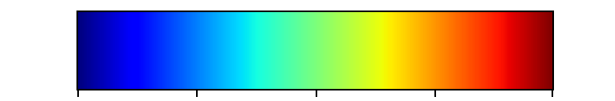

## Examples (Spectrogram Triptych / Grad-CAM / Grad-CAM++ / IG Triptych)

**Sample 0**

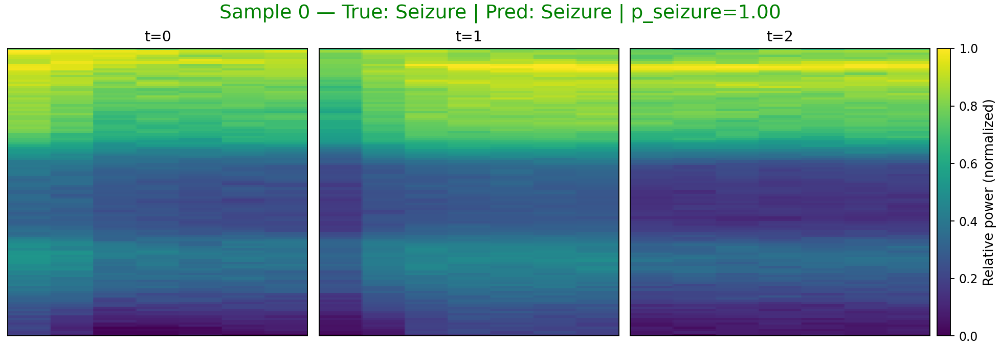

_Spectrogram color: viridis (dark→bright = low→high power)._ 

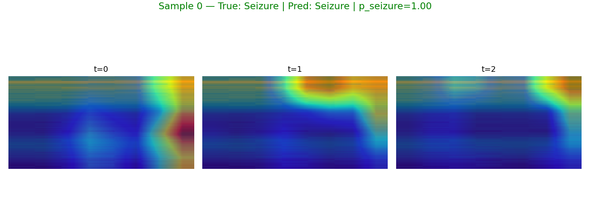

_Grad-CAM color: blue→low importance, red→high importance (overlay on spectrogram)._ 

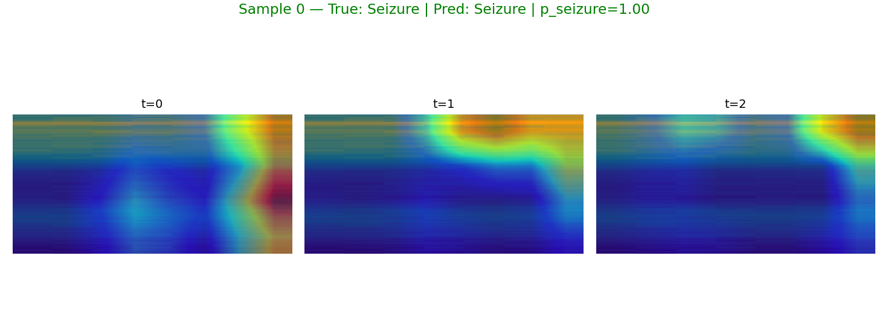

_Grad-CAM++ color: same meaning with improved weighting._ 

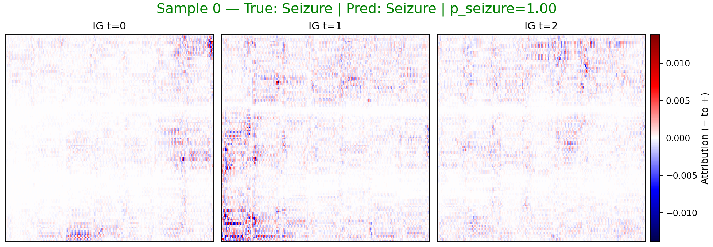

_IG color: blue = negative attribution (toward non-seizure), red = positive (toward seizure)._ 

**Sample 1**

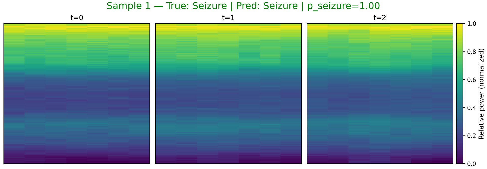

_Spectrogram color: viridis (dark→bright = low→high power)._ 

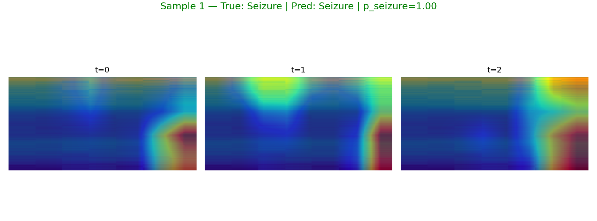

_Grad-CAM color: blue→low importance, red→high importance (overlay on spectrogram)._ 

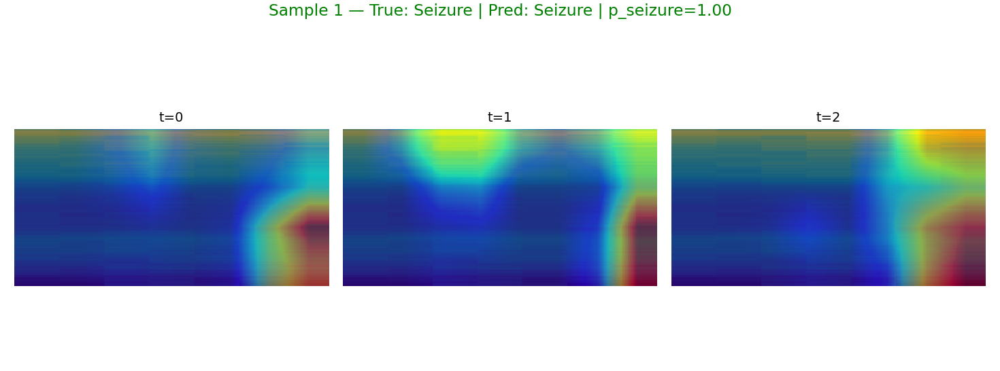

_Grad-CAM++ color: same meaning with improved weighting._ 

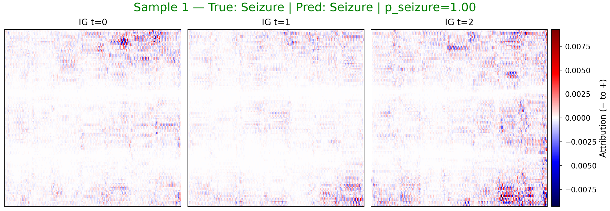

_IG color: blue = negative attribution (toward non-seizure), red = positive (toward seizure)._ 

**Sample 2**

_Spectrogram color: viridis (dark→bright = low→high power)._ 

_Grad-CAM color: blue→low importance, red→high importance (overlay on spectrogram)._ 

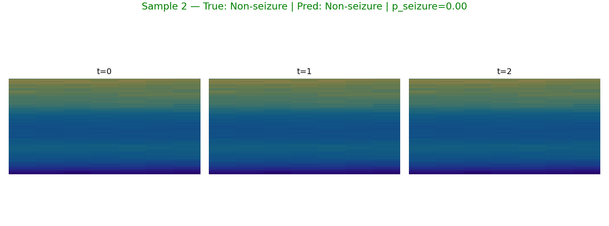

_Grad-CAM++ color: same meaning with improved weighting._ 

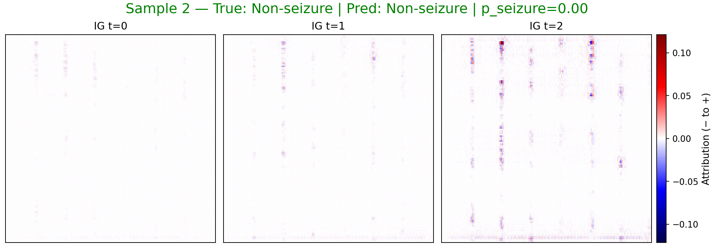

_IG color: blue = negative attribution (toward non-seizure), red = positive (toward seizure)._ 

**Sample 4**

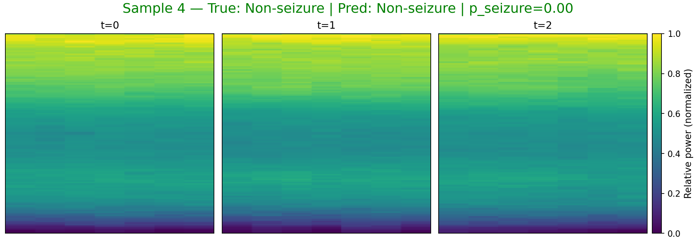

_Spectrogram color: viridis (dark→bright = low→high power)._ 

_Grad-CAM color: blue→low importance, red→high importance (overlay on spectrogram)._ 

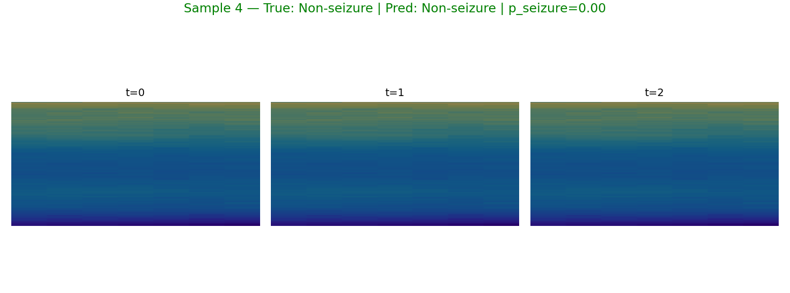

_Grad-CAM++ color: same meaning with improved weighting._ 

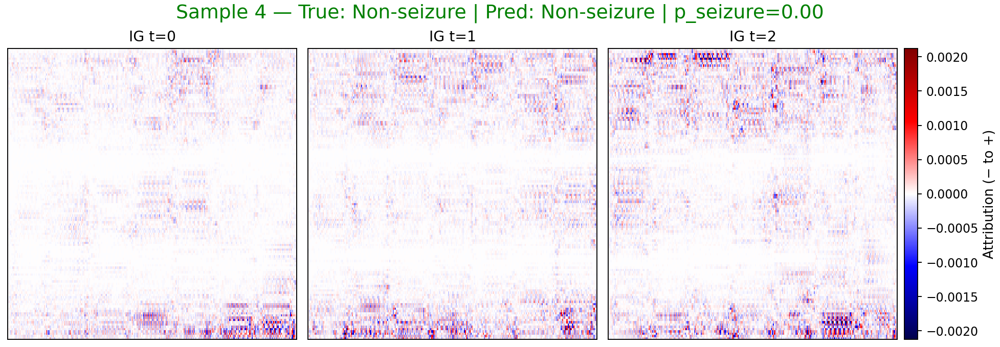

_IG color: blue = negative attribution (toward non-seizure), red = positive (toward seizure)._ 

## LLM Summary
## EEG Spectrogram Classification Report

This report details the performance of a model designed to classify EEG spectrograms as either containing seizure activity or not. Before diving into the results, let's briefly discuss what a seizure is and how it relates to EEG.

**Understanding Seizures and EEG**

A seizure is a sudden, uncontrolled electrical disturbance in the brain. This disturbance can cause changes in behavior, movements, feelings, and levels of consciousness.  Electroencephalography (EEG) is a non-invasive test that measures electrical activity in the brain using electrodes placed on the scalp.  During a seizure, the EEG recording often shows characteristic patterns of abnormal electrical activity.

A spectrogram is a visual representation of the frequencies present in a signal over time. In the context of EEG, a spectrogram displays the different frequency bands of brain activity (e.g., delta, theta, alpha, beta, gamma) and how their power changes over time. Seizures often manifest as distinct patterns in the EEG spectrogram, such as rhythmic spiking or bursts of high-frequency activity.

**Model Performance**

The model achieved the following performance metrics:

*   **Accuracy:** 0.9647
*   **Sensitivity:** 0.8966
*   **Specificity:** 1.0000
*   **F1:** 0.9455
*   **Weighted F1:** 0.9642
*   **Best threshold:** 0.43

These metrics indicate strong performance, particularly the high specificity, meaning the model is very good at correctly identifying instances where seizures are *not* present.

**Observed Samples Analysis**

Let's examine a few specific samples to understand how the model is making its decisions.

*   **Sample 0 & 1 (True: Seizure, Predicted: Seizure):** The model correctly identified these as seizures. The explainability digest, derived from Grad-CAM and Integrated Gradients (IG), indicates that the model is focusing on both the lowest frequency band (B1) and the highest frequency band (B5) at different time points (t=0, t=1, t=2).  The "pos-fraction" being 0.50 suggests that the model is attributing equal importance to both positive and negative contributions within those frequency bands.  In seizure activity, we often see a combination of slow waves (lower frequencies) and fast, rhythmic spiking (higher frequencies). The model's focus on both B1 and B5 supports the presence of seizure activity.

*   **Sample 2 & 4 (True: Non-Seizure, Predicted: Non-Seizure):** The model correctly classified these as non-seizure. The explainability digest shows a consistent focus on either the lowest frequency band (B1) or the highest frequency band (B5) across the three time points. The pos-fraction is close to 0.50. In the absence of a clear, rhythmic pattern or a sudden burst of high-frequency activity, the model correctly identifies these as normal EEG activity.

**Explainability Digest and Medical Significance**

The explainability digest provides valuable insights into the model's decision-making process. By highlighting the specific time-frequency regions that the model emphasizes, we can gain confidence in its ability to identify seizure patterns.

*   **Frequency Bands:** The model's attention to both low (B1) and high (B5) frequency bands is medically relevant. Seizures can manifest with a variety of frequency components, including slow waves (delta and theta) and fast, rhythmic activity (beta and gamma). The model's ability to detect both is crucial for accurate seizure detection.

*   **Temporal Dynamics:** The model's focus shifts between different frequency bands at different time points (t=0, t=1, t=2). This reflects the dynamic nature of seizures, where the frequency content and spatial distribution of electrical activity can change rapidly over time.

**Conclusion**

The EEG spectrogram classification model demonstrates strong performance in identifying seizure activity. The explainability digest provides valuable insights into the model's decision-making process, highlighting the importance of both low and high frequency bands, as well as the temporal dynamics of seizure patterns. This information can be used to further refine the model and improve its accuracy and reliability.

## Notes
- sample 0: true=1, pred=1, p_seizure=1.000, files=[sample0_spec_triptych.png, sample0_gradcam.png, sample0_gradcampp.png, sample0_ig_triptych.png, sample0_ig_t0.png, sample0_ig_t1.png, sample0_ig_t2.png]
- sample 1: true=1, pred=1, p_seizure=1.000, files=[sample1_spec_triptych.png, sample1_gradcam.png, sample1_gradcampp.png, sample1_ig_triptych.png, sample1_ig_t0.png, sample1_ig_t1.png, sample1_ig_t2.png]
- sample 2: true=0, pred=0, p_seizure=0.001, files=[sample2_spec_triptych.png, sample2_gradcam.png, sample2_gradcampp.png, sample2_ig_triptych.png, sample2_ig_t0.png, sample2_ig_t1.png, sample2_ig_t2.png]
- sample 4: true=0, pred=0, p_seizure=0.001, files=[sample4_spec_triptych.png, sample4_gradcam.png, sample4_gradcampp.png, sample4_ig_triptych.png, sample4_ig_t0.png, sample4_ig_t1.png, sample4_ig_t2.png]
