# EEG Spectrogram Model – XAI & Multimodal Report (chb11)

## Metrics
| Metric | Value |
|---|---|
| Accuracy | 100.00% |
| Sensitivity | 100.00% |
| Specificity | 100.00% |
| F1 | 1.0000 |
| Weighted F1 | 1.0000 |
| Best threshold | 0.54 |

Confusion matrix:

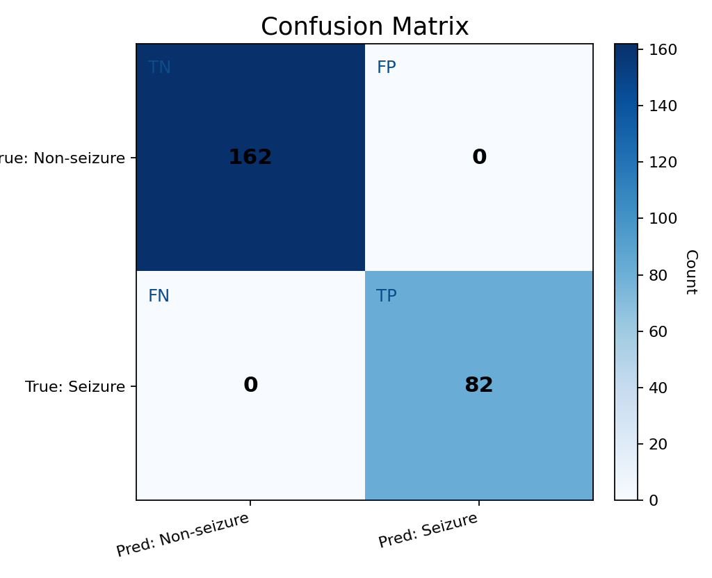

_Quadrant labels: TN = true non-seizure correctly predicted; FP = non-seizure predicted as seizure; FN = seizure predicted as non-seizure; TP = seizure correctly predicted._

## Color keys

## Examples (Spectrogram Triptych / Grad-CAM / Grad-CAM++ / IG Triptych)

**Sample 1**

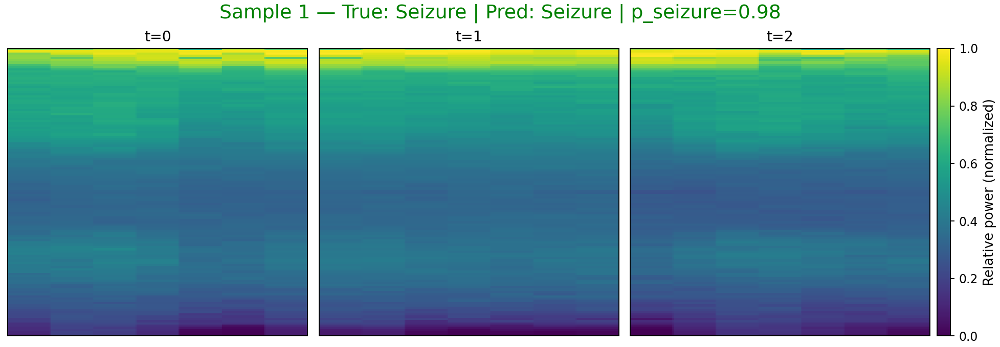

_Spectrogram color: viridis (dark→bright = low→high power)._ 

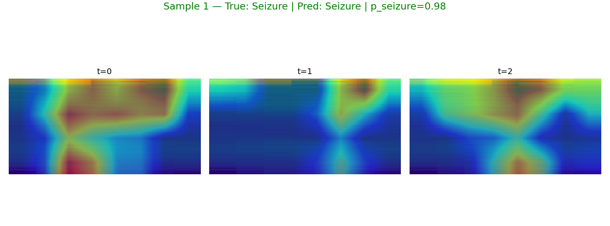

_Grad-CAM color: blue→low importance, red→high importance (overlay on spectrogram)._ 

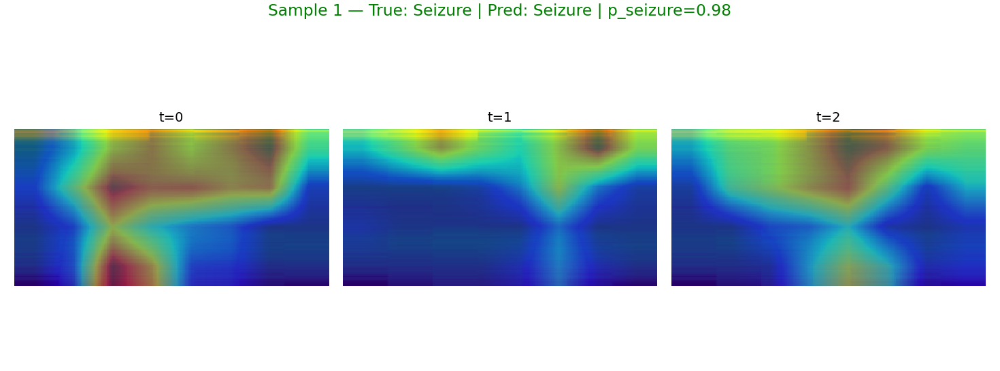

_Grad-CAM++ color: same meaning with improved weighting._ 

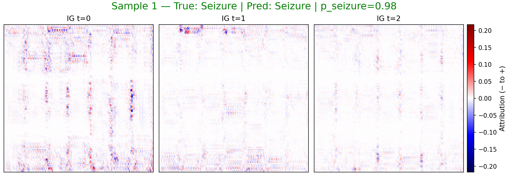

_IG color: blue = negative attribution (toward non-seizure), red = positive (toward seizure)._ 

**Sample 8**

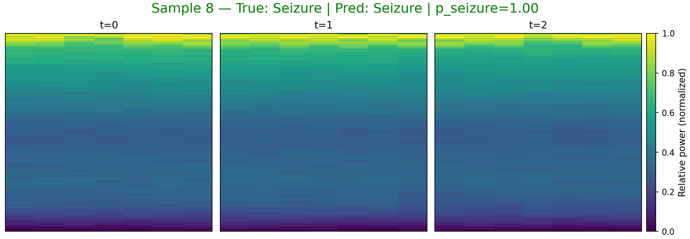

_Spectrogram color: viridis (dark→bright = low→high power)._ 

_Grad-CAM color: blue→low importance, red→high importance (overlay on spectrogram)._ 

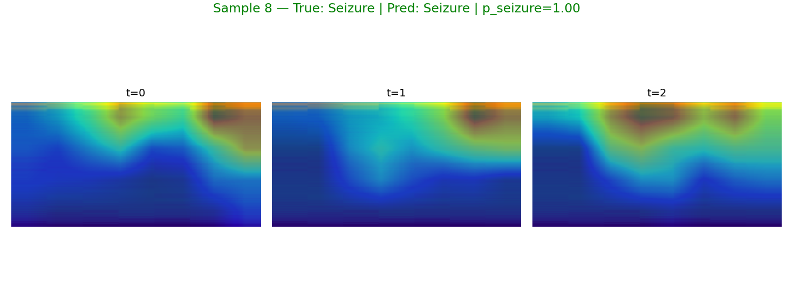

_Grad-CAM++ color: same meaning with improved weighting._ 

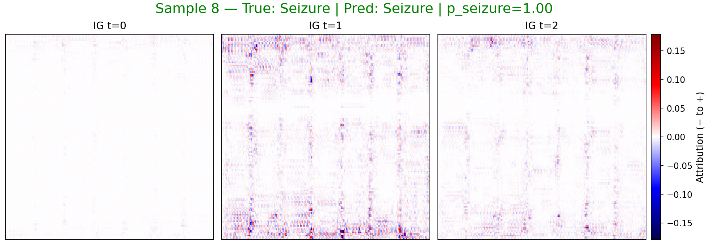

_IG color: blue = negative attribution (toward non-seizure), red = positive (toward seizure)._ 

**Sample 0**

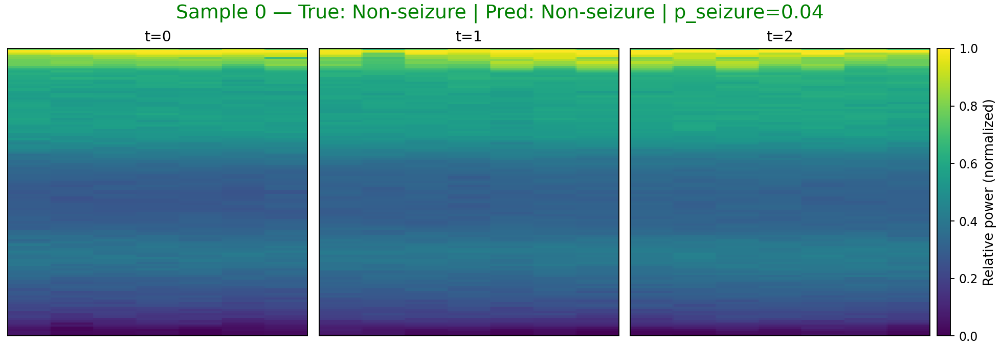

_Spectrogram color: viridis (dark→bright = low→high power)._ 

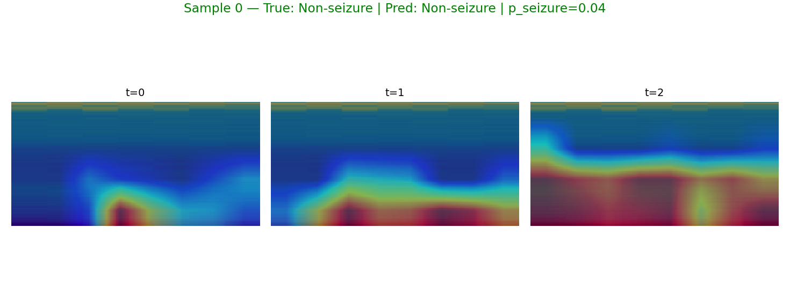

_Grad-CAM color: blue→low importance, red→high importance (overlay on spectrogram)._ 

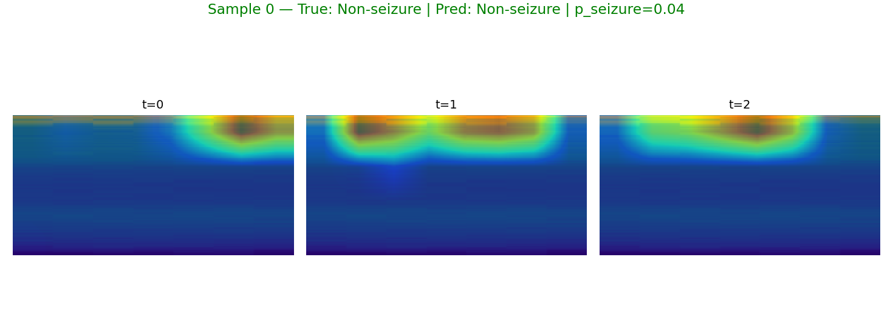

_Grad-CAM++ color: same meaning with improved weighting._ 

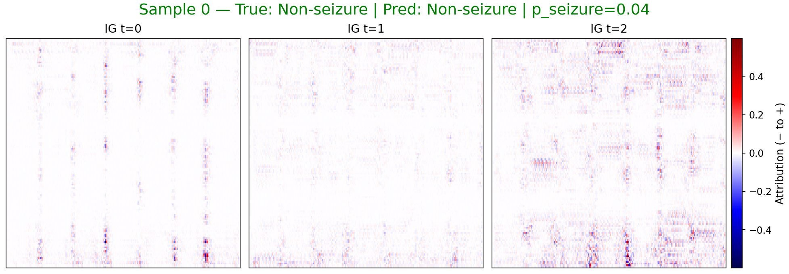

_IG color: blue = negative attribution (toward non-seizure), red = positive (toward seizure)._ 

**Sample 2**

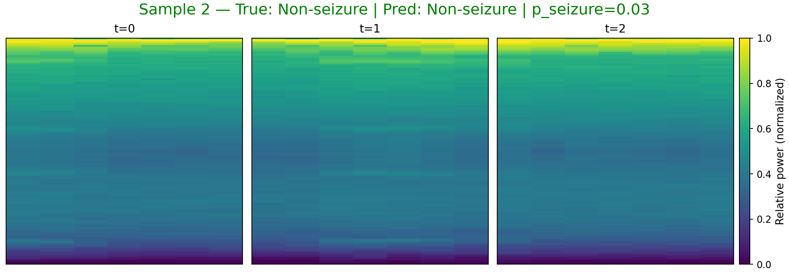

_Spectrogram color: viridis (dark→bright = low→high power)._ 

_Grad-CAM color: blue→low importance, red→high importance (overlay on spectrogram)._ 

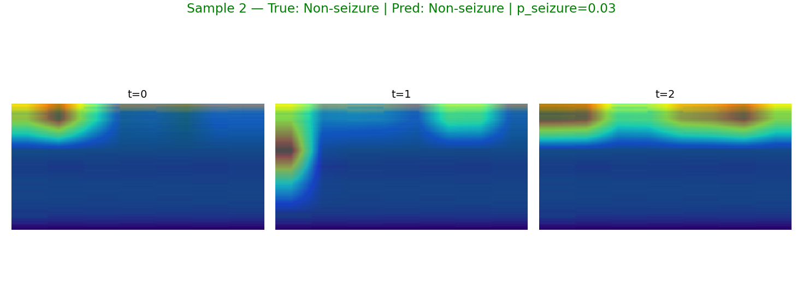

_Grad-CAM++ color: same meaning with improved weighting._ 

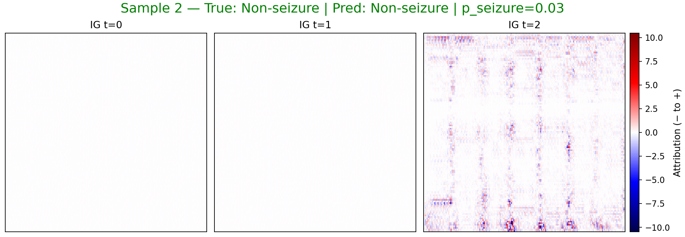

_IG color: blue = negative attribution (toward non-seizure), red = positive (toward seizure)._ 

## LLM Summary
## EEG Spectrogram Classification Report

This report summarizes the performance of a model designed to classify EEG spectrograms as either containing seizure activity or not.

**Understanding Seizures and EEG:**

A seizure is a sudden, uncontrolled electrical disturbance in the brain. Electroencephalography (EEG) is a non-invasive test that records the brain's electrical activity using electrodes placed on the scalp. The raw EEG data is often transformed into a spectrogram, which is a visual representation of the frequencies present in the EEG signal over time. Spectrograms allow us to see changes in brain activity that might be difficult to discern in the raw EEG data. Specific patterns in the spectrogram, such as rhythmic spiking or bursts of high-frequency activity, can indicate seizure activity.

**Model Performance:**

The model achieved the following performance metrics:

*   **Accuracy: 1.0000**
*   **Sensitivity: 1.0000**
*   **Specificity: 1.0000**
*   **F1: 1.0000**
*   **Weighted F1: 1.0000**
*   **Best threshold: 0.54**

These metrics indicate perfect classification performance on the tested dataset. A threshold of 0.54 means that the model classifies a spectrogram as "seizure" if its predicted probability of seizure is greater than 0.54.

**Observed Samples:**

The following samples were analyzed:

*   **Sample 1:** True=Seizure, Predicted=Seizure, Probability of Seizure=0.976
*   **Sample 8:** True=Seizure, Predicted=Seizure, Probability of Seizure=0.997
*   **Sample 0:** True=Non-Seizure, Predicted=Non-Seizure, Probability of Seizure=0.041
*   **Sample 2:** True=Non-Seizure, Predicted=Non-Seizure, Probability of Seizure=0.025

The model correctly classified all four samples, with high confidence (probabilities close to 1 for seizures and close to 0 for non-seizures).

**Explainability Analysis (Grad-CAM/Integrated Gradients):**

To understand *why* the model made its decisions, we used explainability techniques called Grad-CAM and Integrated Gradients (IG). These techniques highlight the regions in the spectrogram that were most important for the model's classification. The analysis is broken down into three time segments (t=0, t=1, t=2). "B5" refers to a specific frequency band, and "B1" refers to the lowest frequency band. "Pos-fraction" indicates the proportion of positive (seizure-related) features within the highlighted region.

*   **Sample 1 (Seizure):** The model consistently emphasized the B5 (highest) frequency band across all three time segments (t=0, t=1, t=2). The pos-fraction is consistently around 0.50-0.51. This suggests that the model identified high-frequency activity as a key indicator of seizure. High-frequency oscillations are often associated with the rapid neuronal firing that occurs during a seizure.

*   **Sample 8 (Seizure):** The model emphasized the B1 (lowest) frequency band at t=0, and the B5 (highest) frequency band at t=1 and t=2. The pos-fraction is consistently around 0.50. The initial emphasis on low-frequency activity could be related to pre-seizure changes in brain activity, while the later emphasis on high-frequency activity is consistent with the seizure itself.

*   **Sample 0 (Non-Seizure):** The model emphasized the B5 (highest) frequency band across all three time segments (t=0, t=1, t=2). The pos-fraction is consistently around 0.49-0.50. The model's attention to high-frequency bands, even in the absence of a seizure, suggests that it might be picking up on normal brain activity or noise in those frequencies. The lower probability score (0.041) indicates that the model did not find strong evidence of seizure activity.

*   **Sample 2 (Non-Seizure):** The model emphasized the B5 (highest) frequency band across all three time segments (t=0, t=1, t=2). The pos-fraction is consistently around 0.50. Similar to Sample 0, the model's attention to high-frequency bands without a seizure suggests it might be picking up on normal brain activity or noise. The very low probability score (0.025) further confirms the absence of seizure-related features.

**Interpretation:**

The model appears to be identifying high-frequency activity as a key feature of seizures, which aligns with the understanding of seizure physiology. However, the model also seems to be sensitive to high-frequency activity even in non-seizure EEG, which could be due to normal brain activity or noise. Further investigation is needed to determine how the model distinguishes between seizure-related high-frequency activity and other sources of high-frequency activity. The model's attention to low-frequency activity in the pre-seizure stage of Sample 8 is also noteworthy and warrants further investigation.

## Notes
- sample 1: true=1, pred=1, p_seizure=0.976, files=[sample1_spec_triptych.png, sample1_gradcam.png, sample1_gradcampp.png, sample1_ig_triptych.png, sample1_ig_t0.png, sample1_ig_t1.png, sample1_ig_t2.png]
- sample 8: true=1, pred=1, p_seizure=0.997, files=[sample8_spec_triptych.png, sample8_gradcam.png, sample8_gradcampp.png, sample8_ig_triptych.png, sample8_ig_t0.png, sample8_ig_t1.png, sample8_ig_t2.png]
- sample 0: true=0, pred=0, p_seizure=0.041, files=[sample0_spec_triptych.png, sample0_gradcam.png, sample0_gradcampp.png, sample0_ig_triptych.png, sample0_ig_t0.png, sample0_ig_t1.png, sample0_ig_t2.png]
- sample 2: true=0, pred=0, p_seizure=0.025, files=[sample2_spec_triptych.png, sample2_gradcam.png, sample2_gradcampp.png, sample2_ig_triptych.png, sample2_ig_t0.png, sample2_ig_t1.png, sample2_ig_t2.png]
