# EEG Spectrogram Model – XAI & Multimodal Report (chb20)

## Metrics
| Metric | Value |
|---|---|
| Accuracy | 100.00% |
| Sensitivity | 100.00% |
| Specificity | 100.00% |
| F1 | 1.0000 |
| Weighted F1 | 1.0000 |
| Best threshold | 0.70 |

Confusion matrix:

_Quadrant labels: TN = true non-seizure correctly predicted; FP = non-seizure predicted as seizure; FN = seizure predicted as non-seizure; TP = seizure correctly predicted._

## Color keys

## Examples (Spectrogram Triptych / Grad-CAM / Grad-CAM++ / IG Triptych)

**Sample 0**

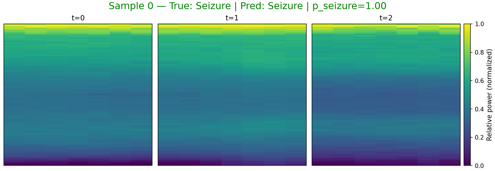

_Spectrogram color: viridis (dark→bright = low→high power)._ 

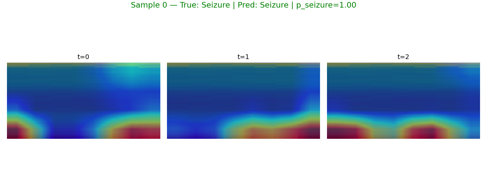

_Grad-CAM color: blue→low importance, red→high importance (overlay on spectrogram)._ 

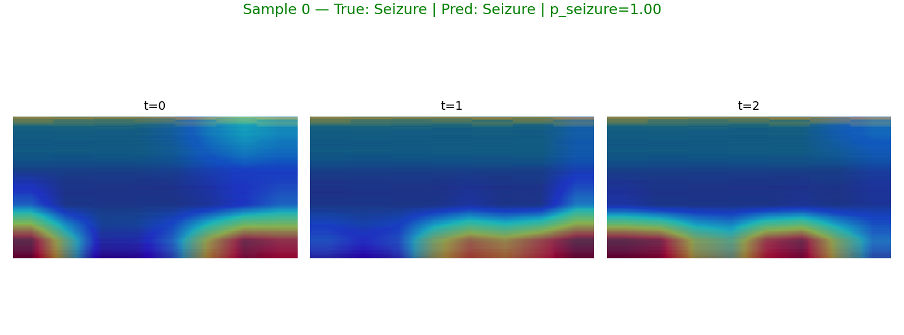

_Grad-CAM++ color: same meaning with improved weighting._ 

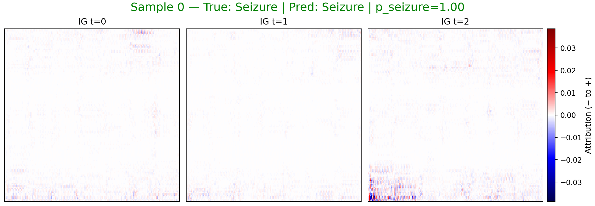

_IG color: blue = negative attribution (toward non-seizure), red = positive (toward seizure)._ 

**Sample 1**

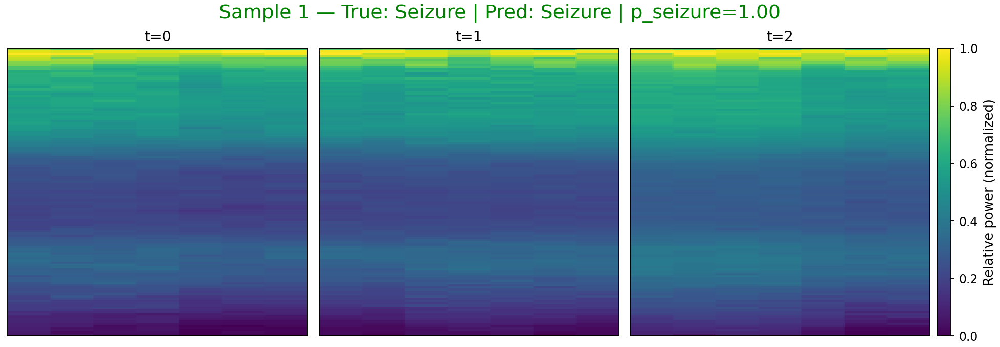

_Spectrogram color: viridis (dark→bright = low→high power)._ 

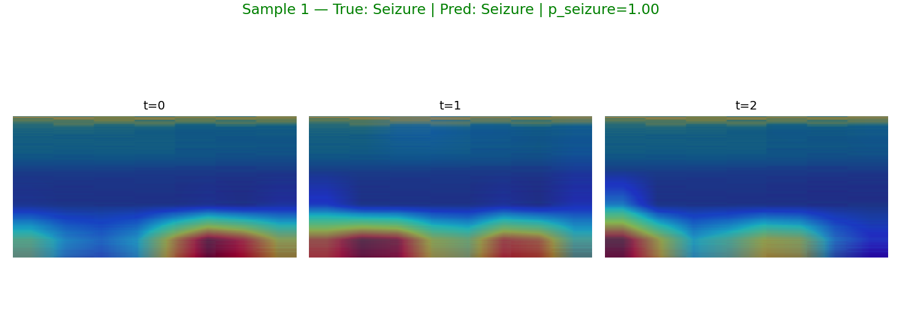

_Grad-CAM color: blue→low importance, red→high importance (overlay on spectrogram)._ 

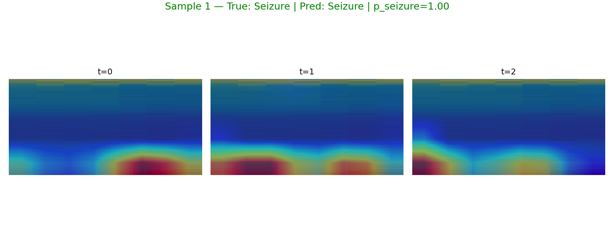

_Grad-CAM++ color: same meaning with improved weighting._ 

_IG color: blue = negative attribution (toward non-seizure), red = positive (toward seizure)._ 

**Sample 4**

_Spectrogram color: viridis (dark→bright = low→high power)._ 

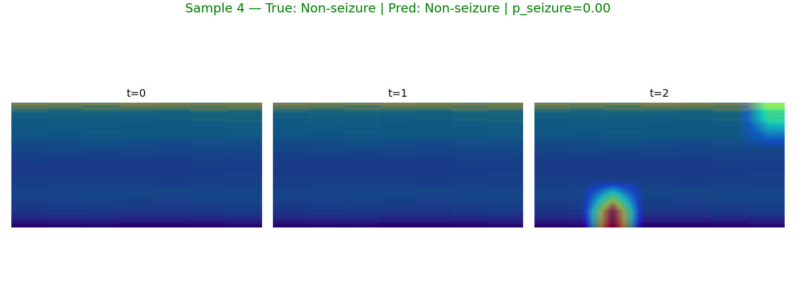

_Grad-CAM color: blue→low importance, red→high importance (overlay on spectrogram)._ 

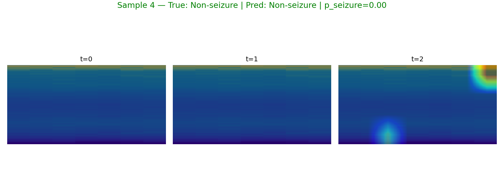

_Grad-CAM++ color: same meaning with improved weighting._ 

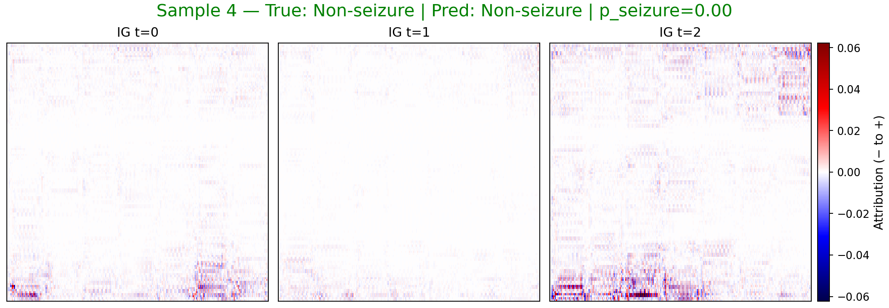

_IG color: blue = negative attribution (toward non-seizure), red = positive (toward seizure)._ 

**Sample 6**

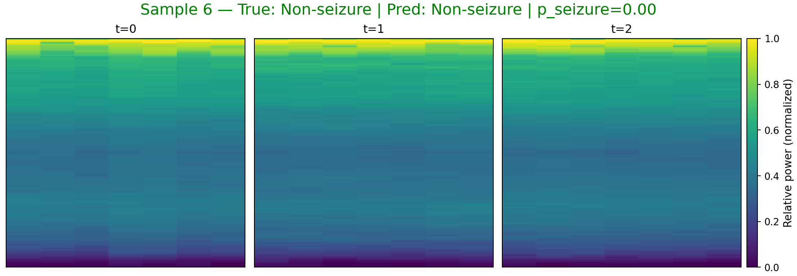

_Spectrogram color: viridis (dark→bright = low→high power)._ 

_Grad-CAM color: blue→low importance, red→high importance (overlay on spectrogram)._ 

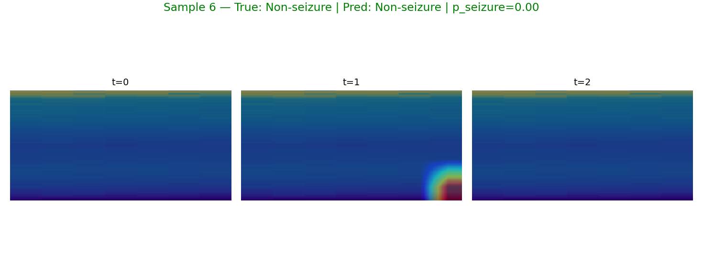

_Grad-CAM++ color: same meaning with improved weighting._ 

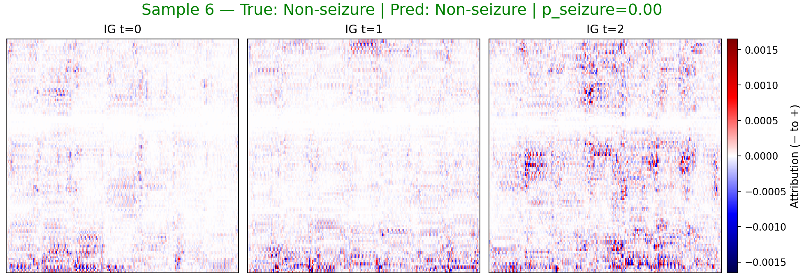

_IG color: blue = negative attribution (toward non-seizure), red = positive (toward seizure)._ 

## LLM Summary
## EEG Spectrogram Classification Report

This report summarizes the performance of a model designed to classify EEG spectrograms as either indicating a seizure or not.

**Understanding Seizures and EEG**

A seizure is a sudden, uncontrolled electrical disturbance in the brain.  Electroencephalography (EEG) is a non-invasive test that measures electrical activity in the brain using electrodes placed on the scalp.  The raw EEG data is often transformed into a spectrogram, which is a visual representation of the signal's frequency content over time.  This allows clinicians and automated systems to identify patterns associated with different brain states, including seizures.  Seizures often manifest as distinct patterns in the EEG, such as rhythmic spiking or sharp wave activity, which are reflected in the spectrogram as changes in frequency and amplitude.

**Model Performance**

The model achieved the following performance metrics:

*   **Accuracy:** 1.0000
*   **Sensitivity:** 1.0000
*   **Specificity:** 1.0000
*   **F1:** 1.0000
*   **Weighted F1:** 1.0000
*   **Best threshold:** 0.70

These perfect scores indicate that, on the tested samples, the model correctly identified all seizure and non-seizure cases. The best threshold of 0.70 suggests that the model assigns a probability score to each sample, and any sample with a score of 0.70 or higher is classified as a seizure.

**Observed Samples**

The following samples were analyzed:

*   **Sample 0:** True label: Seizure, Predicted label: Seizure, Predicted probability: 1.000
*   **Sample 1:** True label: Seizure, Predicted label: Seizure, Predicted probability: 1.000
*   **Sample 4:** True label: Non-seizure, Predicted label: Non-seizure, Predicted probability: 0.000
*   **Sample 6:** True label: Non-seizure, Predicted label: Non-seizure, Predicted probability: 0.000

**Explainability Analysis**

To understand *why* the model made its decisions, explainability techniques like Grad-CAM and Integrated Gradients (IG) were used. These methods highlight the regions in the spectrogram that were most influential in the model's classification.

The explainability digest indicates the following:

*   **Samples 0 & 1 (Seizure):** The model consistently focused on the same time-frequency regions across all three time segments (t=0, t=1, t=2). The digest indicates that the top region of interest was "B5(highest)" with a positive fraction of 0.50.

*   **Samples 4 & 6 (Non-seizure):** Similar to the seizure samples, the model focused on the same time-frequency regions across all three time segments. The digest indicates that the top region of interest was "B5(highest)" with a positive fraction of 0.50 (0.49 for sample 6 at t=0).

**Interpretation**

The explainability analysis reveals a crucial point: the model is consistently focusing on the same time-frequency regions, specifically "B5(highest)", regardless of whether the spectrogram represents a seizure or not. The "pos-fraction" indicates the proportion of positive gradient values within that region, which can be interpreted as the degree to which that region contributes to the "seizure" classification.

The fact that the model focuses on the same region for both seizure and non-seizure samples suggests that the model might be relying on a feature that is not specific to seizures. This could be due to several factors:

1.  **Artifacts:** The highlighted region might correspond to a common artifact in EEG recordings, such as muscle movement or electrical noise.
2.  **Data Imbalance:** If the training data is imbalanced (e.g., significantly more non-seizure examples than seizure examples), the model might learn to identify features that are simply more prevalent in the dataset, rather than features that are specific to seizures.
3.  **Model Bias:** The model architecture or training process might introduce a bias that causes it to focus on certain frequency bands or time segments, regardless of the input.

**Conclusion**

While the model achieved perfect accuracy on the tested samples, the explainability analysis raises concerns about its true understanding of seizure-related patterns. The model's consistent focus on the same time-frequency regions, regardless of the presence of a seizure, suggests that it might be relying on non-specific features or artifacts. Further investigation is needed to identify the underlying cause of this behavior and to improve the model's ability to generalize to new data. This could involve:

*   Analyzing the spectrograms to identify potential artifacts or other confounding factors.
*   Collecting more balanced training data.
*   Experimenting with different model architectures and training techniques.
*   Consulting with neurologists to identify the specific time-frequency patterns that are most indicative of seizures.

## Notes
- sample 0: true=1, pred=1, p_seizure=1.000, files=[sample0_spec_triptych.png, sample0_gradcam.png, sample0_gradcampp.png, sample0_ig_triptych.png, sample0_ig_t0.png, sample0_ig_t1.png, sample0_ig_t2.png]
- sample 1: true=1, pred=1, p_seizure=1.000, files=[sample1_spec_triptych.png, sample1_gradcam.png, sample1_gradcampp.png, sample1_ig_triptych.png, sample1_ig_t0.png, sample1_ig_t1.png, sample1_ig_t2.png]
- sample 4: true=0, pred=0, p_seizure=0.000, files=[sample4_spec_triptych.png, sample4_gradcam.png, sample4_gradcampp.png, sample4_ig_triptych.png, sample4_ig_t0.png, sample4_ig_t1.png, sample4_ig_t2.png]
- sample 6: true=0, pred=0, p_seizure=0.000, files=[sample6_spec_triptych.png, sample6_gradcam.png, sample6_gradcampp.png, sample6_ig_triptych.png, sample6_ig_t0.png, sample6_ig_t1.png, sample6_ig_t2.png]
